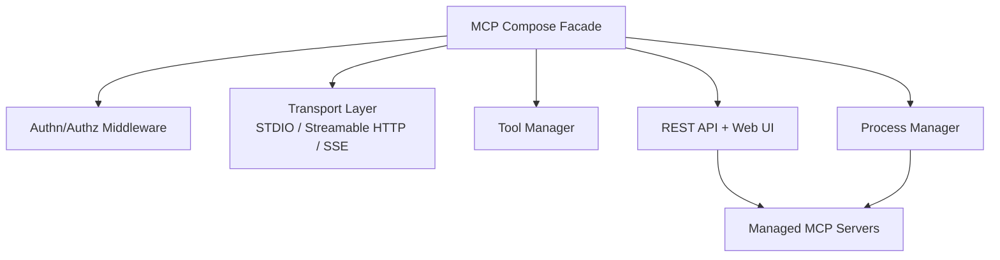

# Architecture

MCP Compose is a Python facade for multiple managed MCP servers. It aggregates tools, prompts, and resources into a single unified MCP server and exposes that aggregation through REST and Web UI.

## Managed MCP servers

A managed server can be:

- Embedded: a Python package implementing an MCP server (loaded in-process)
- Proxied: an external MCP server connected via STDIO, Streamable HTTP, or SSE (deprecated)

## Component overview



## Configuration

All configuration is provided in mcp_compose.toml.

```toml
[composer]
name = "my-unified-server"
conflict_resolution = "prefix"

[[servers]]
name = "filesystem"
command = "python"
args = ["-m", "mcp_server_filesystem", "/data"]
transport = "stdio"
```

## Security

Authentication and authorization are pluggable. Use bearer tokens or OAuth2/OIDC validation when deploying in production.
