# Architecture

MCP Compose acts as a facade for multiple managed MCP servers. It aggregates tools, prompts, and resources into a single unified server and exposes that aggregation through MCP transports, a REST API, and a Web UI.

## High-Level Overview

At its core, MCP Compose sits between MCP clients (like Claude Desktop or VS Code) and multiple downstream MCP servers, presenting them as a single unified endpoint.

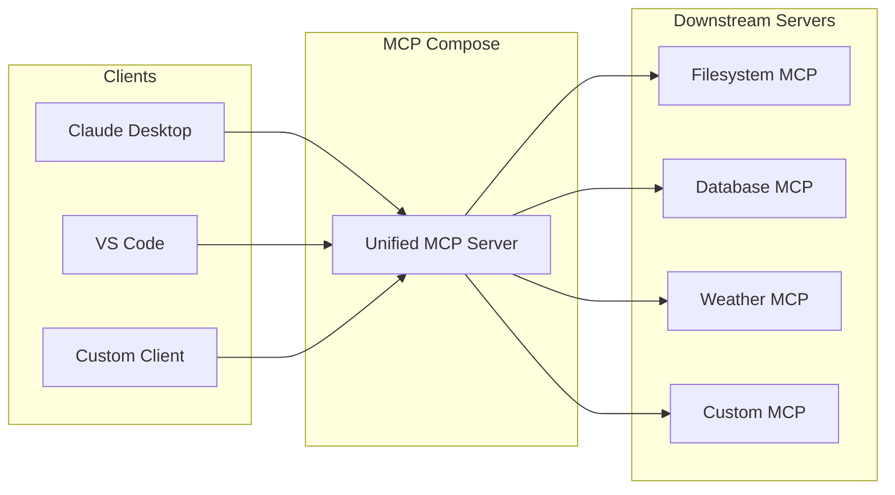

This diagram illustrates the fundamental value proposition of MCP Compose: **multiplexing**. Instead of configuring each MCP client to connect to multiple servers individually (which would require N×M configurations for N clients and M servers), clients connect only to MCP Compose. The facade aggregates all downstream tools into a single unified interface, dramatically simplifying client configuration and enabling centralized management of the entire MCP ecosystem.

---

## Core Building Blocks

### Managed MCP Servers

A managed server is either:

- **Embedded**: a Python package implementing an MCP server (loaded in-process). Use embedded servers when you control the Python package lifecycle and want minimal latency.
- **Proxied**: an external MCP server connected via STDIO, Streamable HTTP, or SSE (deprecated). Use proxied servers when you need to run external binaries, use different Python environments, or connect to remote MCP endpoints.

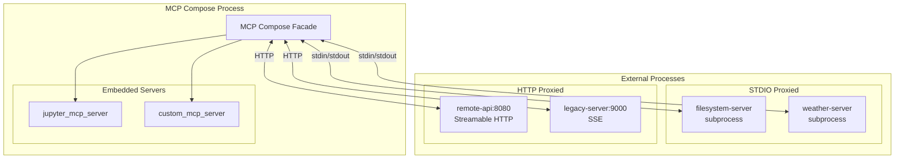

This diagram shows the two categories of managed servers. **Embedded servers** (inside the dashed box) share the MCP Compose Python process, offering zero-latency communication but requiring compatible dependencies. **Proxied servers** run externally—either as local subprocesses communicating via STDIO pipes, or as remote services over HTTP. STDIO proxied servers are ideal for local tools that need process isolation, while HTTP proxied servers enable integration with remote or containerized MCP services.

### Transports

MCP Compose supports the official MCP transports for both upstream (client-facing) and downstream (server-facing) communication:

- **STDIO** for subprocess communication — the client launches MCP Compose as a subprocess
- **Streamable HTTP** for modern, production-ready HTTP streaming — MCP Compose runs as a standalone server
- **SSE (deprecated)** for legacy streaming clients

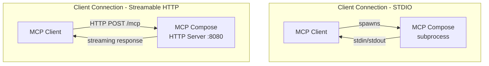

The transport determines how clients connect to MCP Compose. With **STDIO transport**, the client (e.g., Claude Desktop) spawns MCP Compose as a child process and communicates via stdin/stdout—simple to configure but limited to one client per instance. With **Streamable HTTP transport**, MCP Compose runs as a persistent HTTP server that multiple clients can connect to simultaneously, making it suitable for shared team environments or production deployments behind a load balancer.

### Composition and Conflict Resolution

When multiple servers expose tools with the same name, MCP Compose resolves conflicts using a configurable strategy:

- **prefix**: `server_tool` (recommended)
- **suffix**: `tool_server`
- **error**: fail on conflict
- **override**: last server wins
- **ignore**: skip conflicting tools

You can also define per-tool overrides and custom templates.

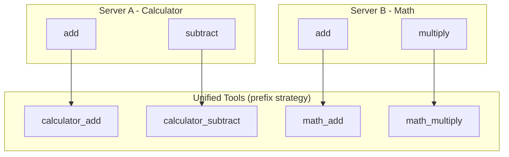

This diagram demonstrates the **prefix** conflict resolution strategy in action. Both the Calculator and Math servers expose an `add` tool. Rather than failing or arbitrarily choosing one, MCP Compose prefixes each tool with its server name, resulting in `calculator_add` and `math_add`. Clients can now explicitly invoke either version. The prefix strategy is recommended because it preserves all tools while making their origin clear, preventing subtle bugs from invoking the wrong implementation.

---

## Component Architecture

The internal architecture consists of several cooperating components that handle different responsibilities.

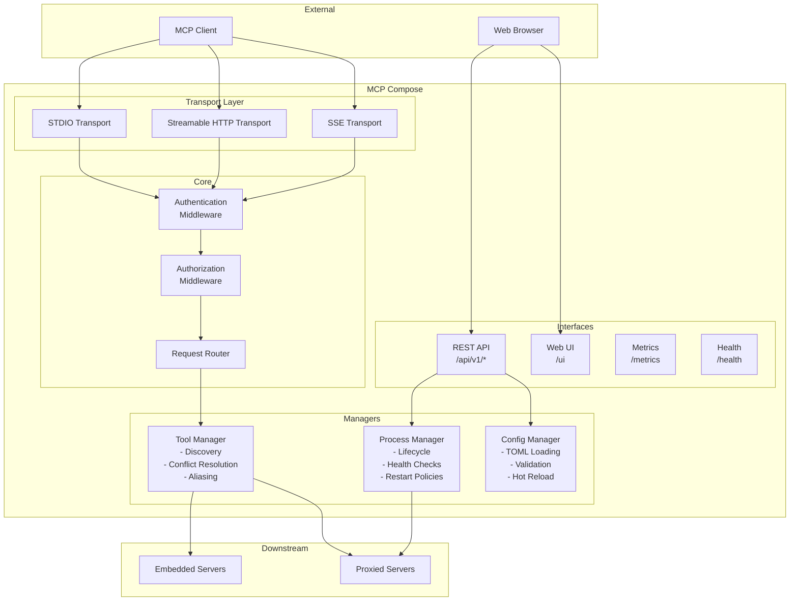

This detailed component diagram shows how requests flow through MCP Compose. Incoming connections arrive at the **Transport Layer**, pass through **Authentication** and **Authorization** middleware, then reach the **Request Router**. The router delegates to the **Tool Manager** for tool operations or to the **REST API** for management tasks. The Tool Manager maintains the unified registry and routes calls to the appropriate downstream server. The **Process Manager** handles lifecycle operations for STDIO servers, while the **Config Manager** loads and validates the TOML configuration. External interfaces expose REST endpoints, a web UI, Prometheus metrics, and health checks.

### Tool Manager

The Tool Manager is responsible for discovering tools from all managed servers, resolving naming conflicts, maintaining the unified tool registry, and routing tool calls to the appropriate downstream server.

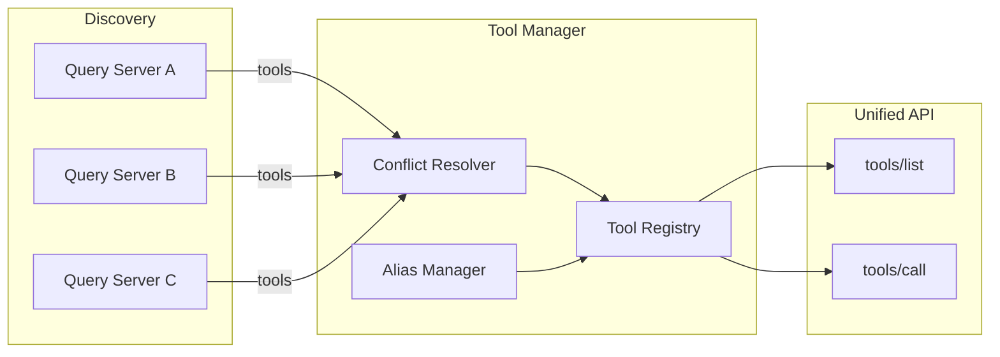

The Tool Manager performs three key functions: **Discovery** queries each managed server for its available tools during startup. The **Conflict Resolver** applies the configured naming strategy to handle duplicate tool names. The **Alias Manager** allows administrators to create alternative names for tools. The resulting **Tool Registry** serves as the single source of truth, powering both the `tools/list` endpoint (which returns all available tools) and the `tools/call` endpoint (which routes invocations to the correct downstream server).

### Process Manager

The Process Manager handles the lifecycle of STDIO-proxied servers: starting, stopping, restarting, health monitoring, and resource limits.

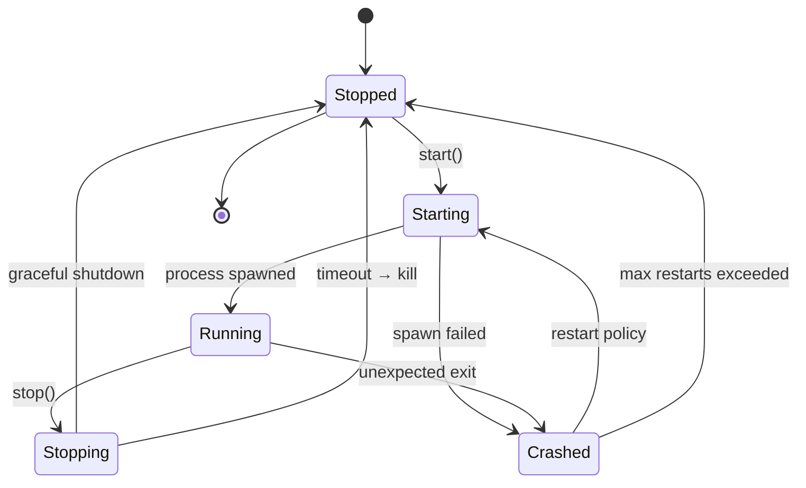

This state machine shows the lifecycle of a STDIO-proxied server process. A server begins in the **Stopped** state and transitions to **Starting** when launched. If the process spawns successfully, it enters **Running**; otherwise, it goes to **Crashed**. A running server can be gracefully stopped (transitioning through **Stopping**) or crash unexpectedly. From **Crashed**, the restart policy determines whether to attempt a restart or give up after reaching the maximum retry count. This model ensures resilience—transient failures trigger automatic recovery while persistent failures are surfaced for operator attention.

---

## Sequence Diagrams

### Server Startup Sequence

When MCP Compose starts, it initializes all configured servers, discovers their tools, and builds the unified registry.

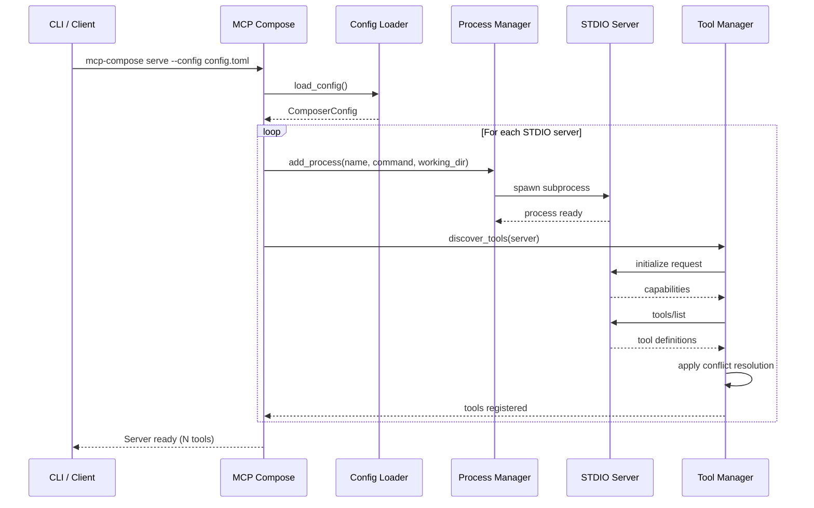

This sequence shows the complete startup flow. When you run `mcp-compose serve`, the CLI first loads and validates the TOML configuration. For each configured STDIO server, MCP Compose spawns the subprocess via the Process Manager, then initiates the MCP handshake: sending an `initialize` request to negotiate capabilities, followed by `tools/list` to discover available tools. The Tool Manager applies conflict resolution rules and registers each tool in the unified registry. Once all servers are initialized, MCP Compose reports the total tool count and begins accepting client connections.

### Tool Invocation Flow

When a client invokes a tool, MCP Compose routes the request to the appropriate downstream server.

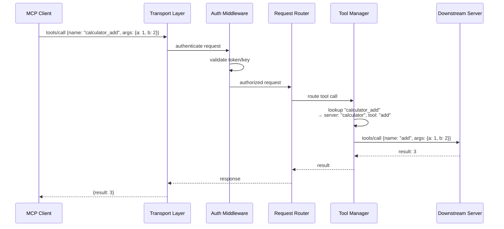

This sequence traces a tool invocation from client to downstream server and back. The client sends a `tools/call` request with the composed tool name (`calculator_add`). The Transport Layer receives the request and passes it to the Auth Middleware for token validation. Once authorized, the Request Router forwards it to the Tool Manager, which looks up the composed name to find the original server (`calculator`) and tool name (`add`). The Tool Manager sends the translated request to the downstream server, receives the result, and bubbles it back through the layers to the client. This indirection is transparent to clients—they simply invoke tools by name.

### Health Check and Auto-Restart

The Process Manager periodically checks server health and automatically restarts failed servers.

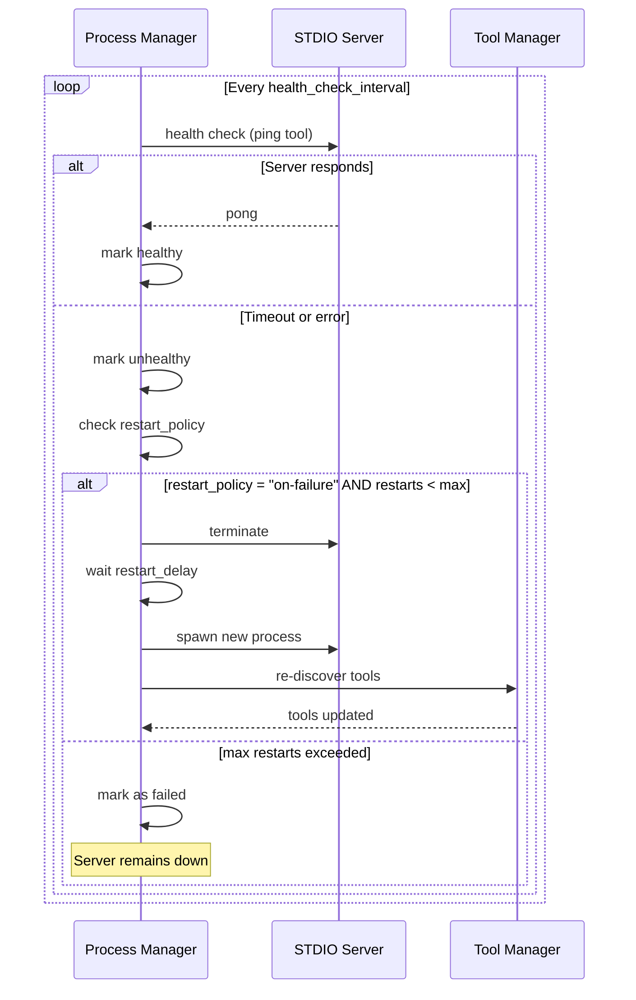

This sequence illustrates the health monitoring loop. At regular intervals (configured via `health_check_interval`), the Process Manager pings each server—typically by invoking a designated health tool. If the server responds within the timeout, it's marked healthy. If not, the Process Manager consults the restart policy: with `on-failure`, it terminates the unresponsive process, waits the configured delay, spawns a new instance, and re-discovers its tools to update the registry. After exhausting the maximum restart attempts, the server is marked as permanently failed, requiring manual intervention. This self-healing behavior keeps the system running despite transient downstream failures.

### Client Connection via Streamable HTTP

Shows the full flow when a client connects over HTTP and invokes tools.

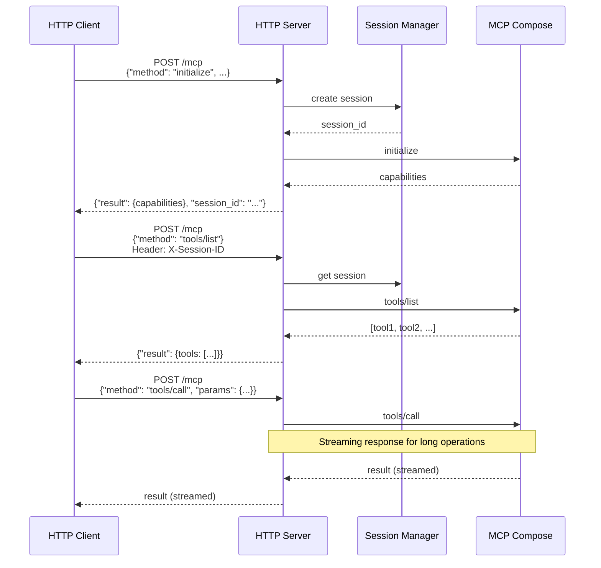

This sequence shows an HTTP client establishing a session and invoking tools. The first request (`initialize`) creates a new session and returns a session ID along with server capabilities. Subsequent requests include this session ID in a header, allowing the server to maintain context across requests. When invoking a tool, the response may be streamed—particularly useful for long-running operations that produce incremental output. Streaming enables clients to display partial results in real-time rather than waiting for the entire operation to complete, improving the user experience for tools that process large datasets or perform multi-step operations.

---

## Configuration

All configuration lives in a single `mcp_compose.toml` file. See the [Configuration](/configuration) page for the complete reference.

A minimal example:

```toml
[composer]
name = "my-unified-server"
conflict_resolution = "prefix"

[[servers.proxied.stdio]]
name = "filesystem"
command = ["python", "-m", "mcp_server_filesystem", "/data"]
working_dir = "${MCP_COMPOSE_CONFIG_DIR}"
```

---

## Security

Authentication and authorization are pluggable middleware components that intercept all requests before they reach the core routing logic.

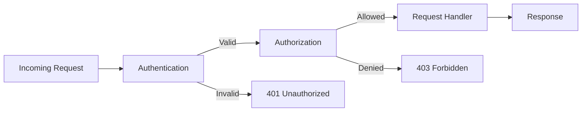

This diagram shows the security middleware pipeline. Every incoming request first passes through **Authentication (AuthN)**, which verifies the client's identity—rejecting unauthenticated requests with 401 Unauthorized. Authenticated requests then pass through **Authorization (AuthZ)**, which checks whether the identified user has permission to perform the requested action—rejecting unauthorized requests with 403 Forbidden. Only requests that pass both checks reach the actual handler. This layered approach ensures defense in depth: even if an attacker obtains valid credentials, they're still constrained by their assigned permissions.

Supported authentication methods:
- **API Keys** for simple internal use
- **JWT** for stateless token validation
- **OAuth2/OIDC** for enterprise identity providers
- **mTLS** for certificate-based authentication

Use bearer tokens or OAuth2/OIDC validation when deploying in production.
