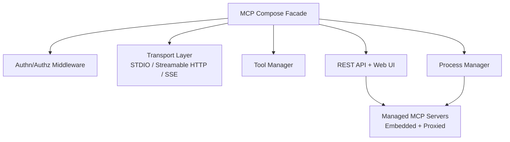

# Architecture

MCP Compose acts as a facade for multiple managed MCP servers. It aggregates tools, prompts, and resources into a single unified server and exposes that aggregation through MCP transports, a REST API, and a Web UI.

## Core Building Blocks

### Managed MCP Servers

A managed server is either:

- **Embedded**: a Python package implementing an MCP server (loaded in-process). Use embedded servers when you control the Python package lifecycle.
- **Proxied**: an external MCP server connected via STDIO, Streamable HTTP, or SSE (deprecated). Use proxied servers when you need to run external binaries or connect to remote MCP endpoints.

### Transports

MCP Compose supports the official MCP transports:

- **STDIO** for subprocess communication
- **Streamable HTTP** for modern, production-ready HTTP streaming
- **SSE (deprecated)** for legacy streaming clients

### Composition and Conflict Resolution

When multiple servers expose tools with the same name, MCP Compose resolves conflicts using a configurable strategy:

- **prefix**: `server:tool`
- **suffix**: `tool:server`
- **error**: fail on conflict
- **override**: last server wins

You can also define per-tool overrides and custom templates.

## Component Overview



## Configuration

All configuration lives in a single `mcp_compose.toml` file. A minimal example:

```toml
[composer]
name = "my-unified-server"
conflict_resolution = "prefix"

[[servers]]
name = "filesystem"
command = "python"
args = ["-m", "mcp_server_filesystem", "/data"]
transport = "stdio"
```

## Security

Authentication and authorization are pluggable. Use bearer tokens or OAuth2/OIDC validation when deploying in production.
