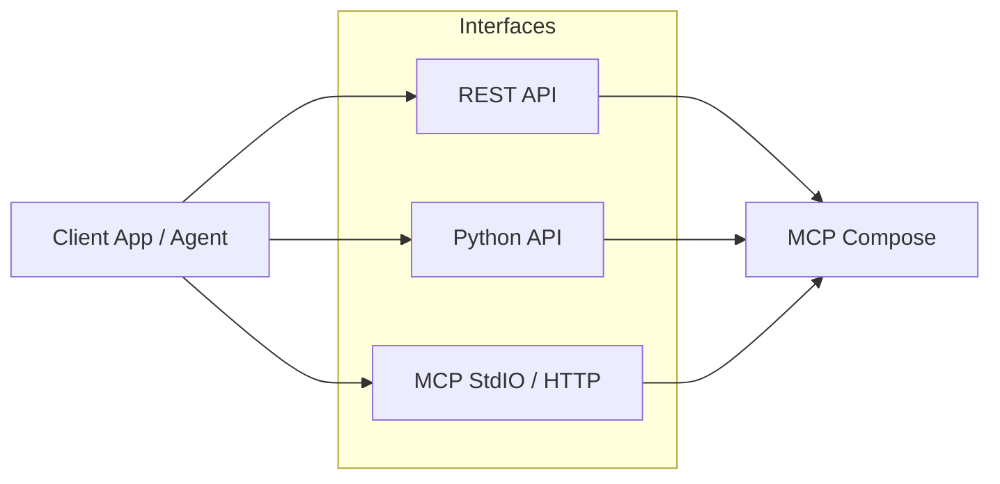

# Integrations

MCP Compose integrates with applications and agent frameworks via three main interfaces:

1. **REST API** for programmatic control
2. **Python API** for native async workflows
3. **MCP transports** for MCP-native clients and gateways



## REST API integration

The REST API is available at /api/v1 by default.

List tools:

    GET /api/v1/tools

Invoke a tool:

```
    POST /api/v1/tools/{tool_name}/invoke
```

Example request:

```
    curl -X POST http://localhost:8000/api/v1/tools/calculator:add/invoke \
      -H "Content-Type: application/json" \
      -d '{"a": 5, "b": 3}'
```

## Python API integration

Use the Python API to orchestrate servers and call tools directly:

    from mcp_compose import MCPServerComposer

    composer = MCPServerComposer()
    composer.load_config("mcp_compose.toml")

    # Start all servers
    for server in composer.servers.values():
        await composer.start_server(server.name)

    # Discover tools
    tools = await composer.list_tools()
    print([t.name for t in tools])

    # Invoke a tool
```
    result = await composer.invoke_tool("calculator:add", {"a": 5, "b": 3})
    print(result)
```

## MCP transport integration

Expose MCP Compose as a unified MCP server using STDIO or Streamable HTTP. Clients can connect using any MCP SDK that supports these transports.

### STDIO

    mcp-composer serve --transport stdio --config mcp_compose.toml

### Streamable HTTP

    mcp-composer serve --transport streamable-http --config mcp_compose.toml

## WebSocket streaming

Subscribe to live metrics and logs:

    WS /ws/metrics
    WS /ws/logs

## Authentication

When auth is enabled, pass bearer tokens in the Authorization header:

    Authorization: Bearer YOUR_TOKEN
