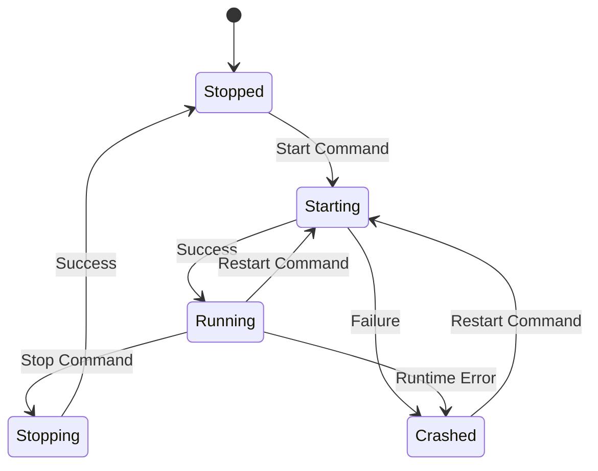

# Execution

This section covers runtime operations: starting/stopping servers, invoking tools, and monitoring the system.

## Start the composer

```
mcp-compose serve --config mcp_compose.toml
```

## Server management

### Server Lifecycle



### CLI

Start a server:

```
mcp-compose start-server filesystem
```

Stop a server:

```
mcp-compose stop-server filesystem
```

Restart a server:

```
mcp-compose restart-server filesystem
```

### REST API

```
POST /api/v1/servers/{server_id}/start
POST /api/v1/servers/{server_id}/stop
POST /api/v1/servers/{server_id}/restart
```

Example:

```bash
curl -X POST http://localhost:8000/api/v1/servers/filesystem/start
```

## Tool invocation

### CLI

```bash
mcp-compose invoke-tool calculator:add '{"a": 5, "b": 3}'
```

### REST API

```
POST /api/v1/tools/{tool_name}/invoke
```

Example:

```bash
curl -X POST http://localhost:8000/api/v1/tools/calculator:add/invoke \
	-H "Content-Type: application/json" \
	-d '{"a": 5, "b": 3}'
```

## Monitoring

### Health and status

```
GET /api/v1/health
GET /api/v1/status
GET /api/v1/status/composition
```

### Metrics

```
GET /api/v1/status/metrics
```

### WebSockets

```
WS /ws/logs
WS /ws/metrics
```

The Web UI exposes the same views with live updates for logs, metrics, and server status.

## Troubleshooting

- Verify the configuration file loads without errors.
- Check server logs for startup failures.
- Use the Tools page to confirm tool discovery.
- Use the health endpoint for readiness checks.
