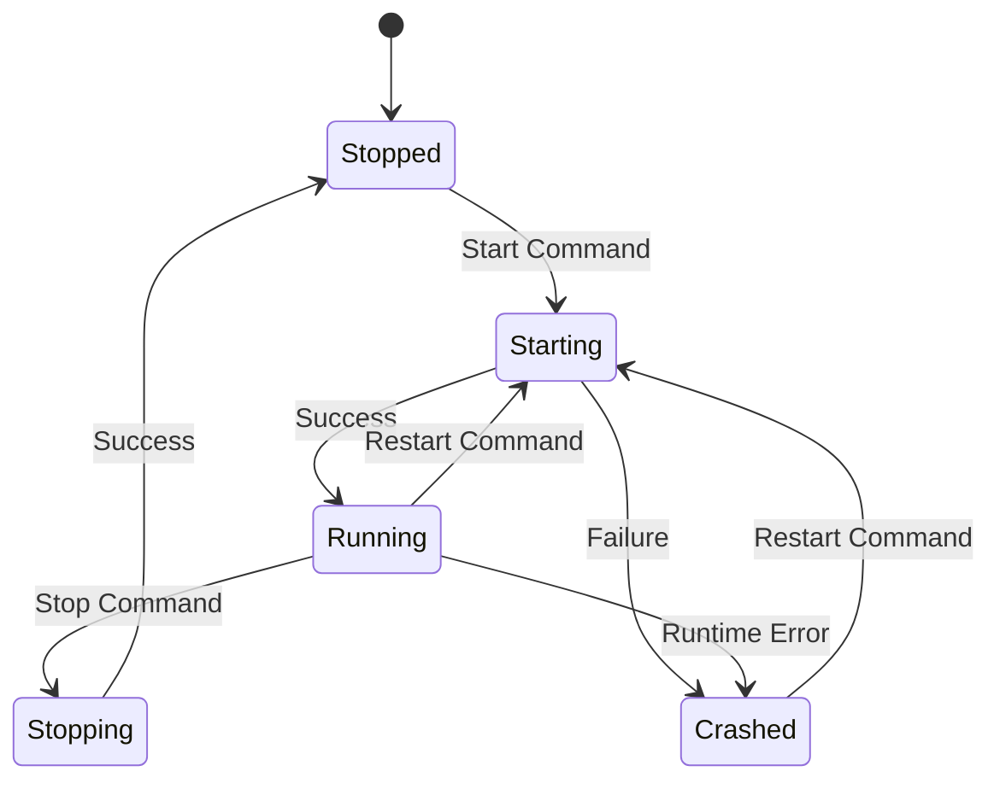
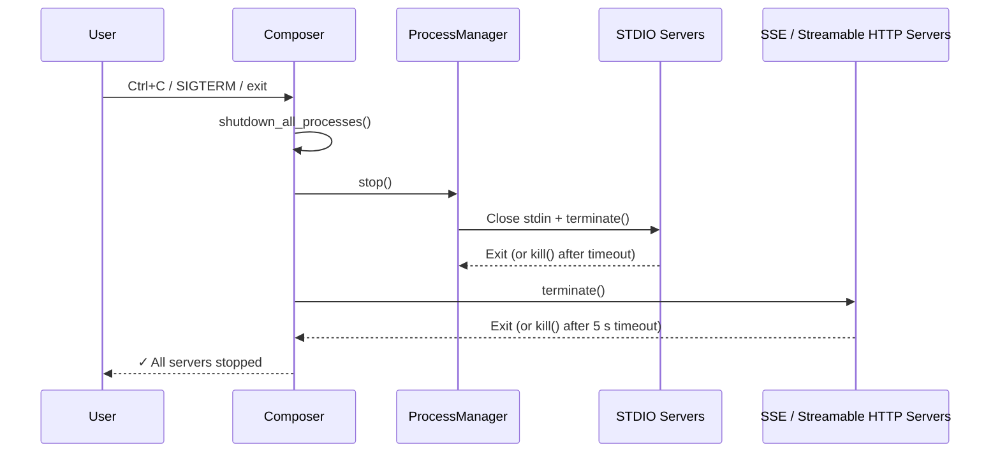

# Operations

This section covers runtime operations: starting/stopping servers, invoking tools, and monitoring the system.

## Start the composer

```
mcp-compose serve --config mcp_compose.toml
```

## Server management

### Server Lifecycle



### CLI

Start a server:

```
mcp-compose start-server filesystem
```

Stop a server:

```
mcp-compose stop-server filesystem
```

Restart a server:

```
mcp-compose restart-server filesystem
```

### User Interface (UI)

The Web UI provides a visual dashboard for managing server lifecycles. From the Servers page, you can view the status of all configured servers at a glance, start or stop individual servers with a single click, and trigger restarts when needed. The UI displays real-time status updates, showing when servers transition between states (Starting, Running, Stopped, Crashed). Server logs are also accessible directly from the UI, making it easy to diagnose startup failures or runtime errors without switching to the terminal.

### REST API

```
POST /api/v1/servers/{server_id}/start
POST /api/v1/servers/{server_id}/stop
POST /api/v1/servers/{server_id}/restart
```

Example:

```bash
curl -X POST http://localhost:8000/api/v1/servers/filesystem/start
```

## Tool invocation

### CLI

```bash
mcp-compose invoke-tool calculator:add '{"a": 5, "b": 3}'
```

### REST API

```
POST /api/v1/tools/{tool_name}/invoke
```

Example:

```bash
curl -X POST http://localhost:8000/api/v1/tools/calculator:add/invoke \
	-H "Content-Type: application/json" \
	-d '{"a": 5, "b": 3}'
```

## Monitoring

### Health and status

```
GET /api/v1/health
GET /api/v1/status
GET /api/v1/status/composition
```

### Metrics

```
GET /api/v1/status/metrics
```

### WebSockets

```
WS /ws/logs
WS /ws/metrics
```

The Web UI exposes the same views with live updates for logs, metrics, and server status.

## Troubleshooting

- Verify the configuration file loads without errors.
- Check server logs for startup failures.
- Use the Tools page to confirm tool discovery.
- Use the health endpoint for readiness checks.

## Graceful Shutdown and Downstream Process Cleanup

When MCP Compose exits — whether via `Ctrl+C`, `SIGTERM`, or normal termination — it automatically terminates **all** downstream MCP server processes it started. This prevents ghost or stale server processes from lingering on the host.

### What gets cleaned up

| Transport type | How it runs | Shutdown mechanism |
|---|---|---|
| **STDIO proxied servers** | Managed by `ProcessManager` as async subprocesses | `ProcessManager.stop()` closes stdin then sends SIGTERM/SIGKILL |
| **Auto-started SSE servers** | Launched as `subprocess.Popen` when `auto_start = true` | SIGTERM → wait → SIGKILL escalation |
| **Auto-started Streamable HTTP servers** | Launched as `subprocess.Popen` when `auto_start = true` | SIGTERM → wait → SIGKILL escalation |

### Shutdown sequence



### Graceful then forced termination

Each downstream process is given a chance to shut down gracefully:

1. `Popen.terminate()` is called first.
2. MCP Compose waits up to **5 seconds** (configurable) for the process to exit.
3. If the process is still running after the timeout, `Popen.kill()` is called to force termination.

This two-step approach ensures well-behaved servers can clean up resources, while misbehaving servers are never left running.

:::note[Platform-specific behaviour]

| | `terminate()` | `kill()` |
|---|---|---|
| **Unix / macOS** | Sends **SIGTERM** — the child process can catch it and perform graceful cleanup. | Sends **SIGKILL** — cannot be caught or ignored; the process is killed immediately. |
| **Windows** | Calls **TerminateProcess** — the child is forcefully terminated and **cannot** catch or ignore it. | Also calls **TerminateProcess** — identical behaviour to `terminate()`. |

In practice this means the two-step escalation (graceful → forced) only applies on Unix-like systems. On Windows, `terminate()` already forces immediate termination, so the timeout and `kill()` fallback are effectively no-ops.

:::

### Signal handling

MCP Compose maintains a **module-level registry** of all active composer instances. Signal handlers for `SIGTERM` and `SIGINT` are installed automatically when the first composer is created (in `__init__`, not only on `start()`). When either signal is received, every registered composer runs the full shutdown sequence. This ensures:

- Downstream servers are cleaned up even if `start()` was never called explicitly.
- Multiple `MCPServerComposer` instances in the same process are all shut down — no instance overwrites another's handlers.
- Original signal handlers are restored once the last composer unregisters (via `stop()`).

### Example log output

```
INFO  Shutting down all downstream MCP server processes
INFO  ProcessManager stopped – all STDIO proxied servers terminated
INFO  Terminating 2 auto-started downstream server(s) (SSE / Streamable HTTP)
INFO  Terminating process my-sse-server (PID 42101)
INFO  Process my-sse-server (PID 42101) terminated gracefully
INFO  Terminating process my-http-server (PID 42102)
WARN  Process my-http-server (PID 42102) did not terminate gracefully, sending SIGKILL
INFO  Process my-http-server (PID 42102) killed
INFO  All auto-started downstream servers terminated
INFO  Composer my-compose stopped
✓ All servers stopped
```
